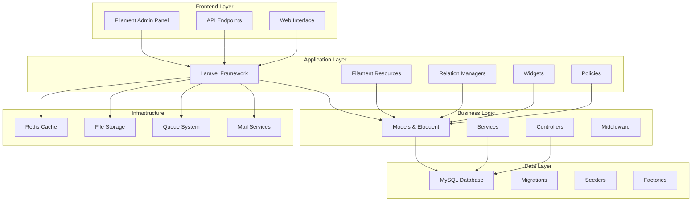
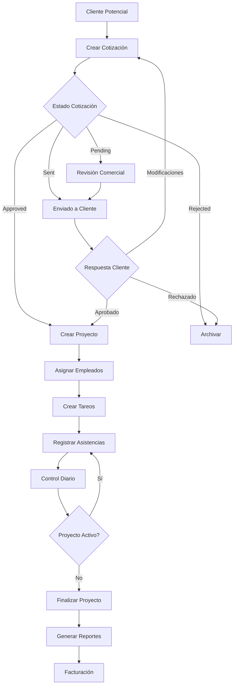
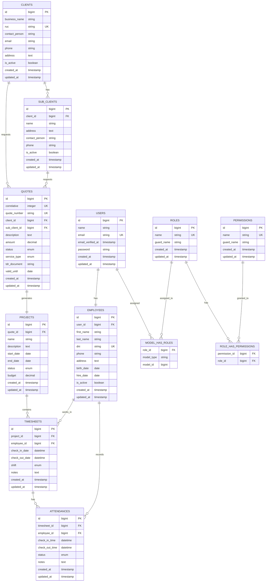
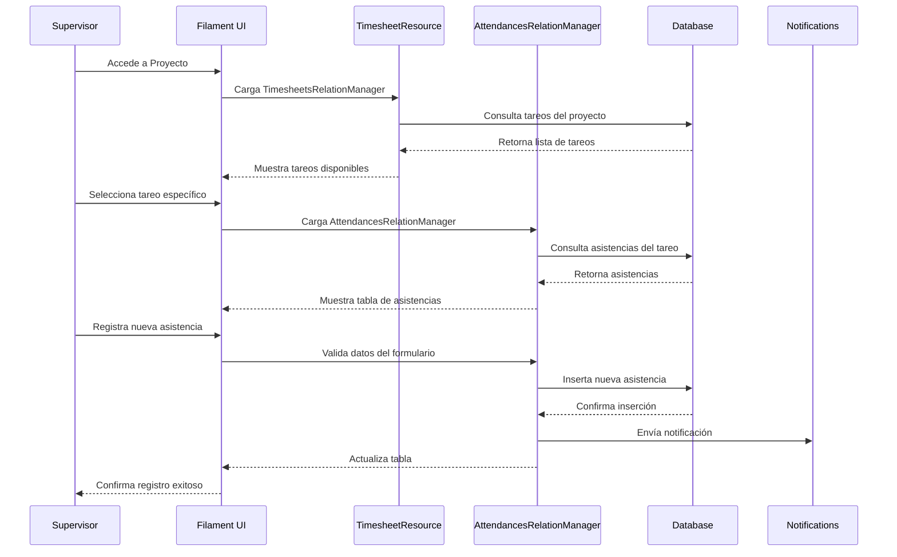
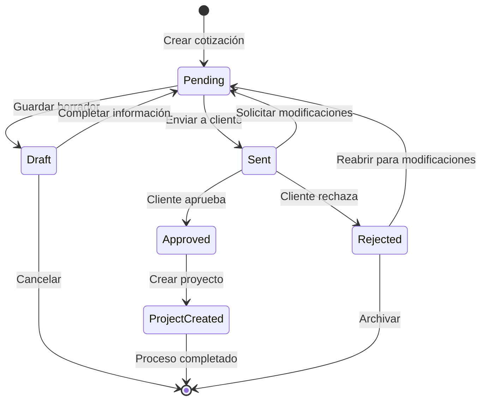
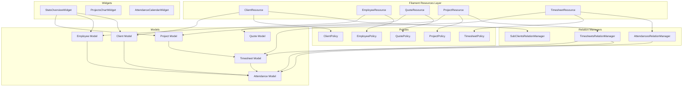

# Documentación Técnica Avanzada
## Sistema SAT Industriales - Arquitectura y Diagramas

### Diagramas de Arquitectura del Sistema

#### 1. Arquitectura General del Sistema



#### 2. Diagrama de Flujo de Proceso de Negocio



#### 3. Diagrama de Entidad-Relación (ERD)



#### 4. Diagrama de Secuencia - Proceso de Tareo



#### 5. Diagrama de Estados - Cotización



#### 6. Diagrama de Componentes - Filament Resources



### Especificaciones Técnicas Detalladas

#### 1. Estructura de Archivos del Proyecto

```
app/
├── Filament/
│   ├── Resources/
│   │   ├── ClientResource.php
│   │   │   └── RelationManagers/
│   │   │       └── SubClientsRelationManager.php
│   │   ├── EmployeeResource.php
│   │   ├── QuoteResource.php
│   │   ├── ProjectResource.php
│   │   │   └── RelationManagers/
│   │   │       └── TimesheetsRelationManager.php
│   │   └── TimesheetResource.php
│   │       └── RelationManagers/
│   │           └── AttendancesRelationManager.php
│   └── Widgets/
│       ├── StatsOverviewWidget.php
│       ├── ProjectsChartWidget.php
│       └── AttendanceCalendarWidget.php
├── Http/
│   ├── Controllers/
│   │   ├── Api/
│   │   │   ├── AttendanceApiController.php
│   │   │   ├── ProjectApiController.php
│   │   │   └── TimesheetApiController.php
│   │   └── Web/
│   │       └── DashboardController.php
│   └── Middleware/
│       ├── CheckRole.php
│       └── ValidateApiToken.php
├── Models/
│   ├── User.php
│   ├── Employee.php
│   ├── Client.php
│   ├── SubClient.php
│   ├── Quote.php
│   ├── Project.php
│   ├── Timesheet.php
│   └── Attendance.php
├── Policies/
│   ├── ClientPolicy.php
│   ├── EmployeePolicy.php
│   ├── QuotePolicy.php
│   ├── ProjectPolicy.php
│   └── TimesheetPolicy.php
├── Exports/
│   ├── AttendancesExport.php
│   └── AttendanceTemplateExport.php
└── Imports/
    └── AttendancesImport.php
```

#### 2. Configuración de Permisos y Roles

```php
// Configuración de roles en DatabaseSeeder
$roles = [
    'super_admin' => [
        'name' => 'Super Admin',
        'permissions' => ['*'] // Todos los permisos
    ],
    'comercial' => [
        'name' => 'Comercial',
        'permissions' => [
            'view_clients', 'create_clients', 'edit_clients',
            'view_quotes', 'create_quotes', 'edit_quotes',
            'view_projects', 'create_projects', 'edit_projects'
        ]
    ],
    'supervisor' => [
        'name' => 'Supervisor',
        'permissions' => [
            'view_employees', 'create_employees', 'edit_employees',
            'view_timesheets', 'create_timesheets', 'edit_timesheets',
            'view_attendances', 'create_attendances', 'edit_attendances'
        ]
    ],
    'administrativo' => [
        'name' => 'Administrativo',
        'permissions' => [
            'view_clients', 'view_employees', 'view_quotes',
            'view_projects', 'view_timesheets', 'view_attendances',
            'export_data'
        ]
    ]
];
```

#### 3. API Endpoints Completos

```php
// routes/api.php
Route::middleware(['auth:sanctum'])->group(function () {
    
    // Autenticación
    Route::post('/login', [AuthController::class, 'login']);
    Route::post('/logout', [AuthController::class, 'logout']);
    Route::get('/user', [AuthController::class, 'user']);
    
    // Clientes
    Route::apiResource('clients', ClientApiController::class);
    Route::get('clients/{client}/sub-clients', [ClientApiController::class, 'subClients']);
    
    // Empleados
    Route::apiResource('employees', EmployeeApiController::class);
    Route::get('employees/active', [EmployeeApiController::class, 'active']);
    
    // Cotizaciones
    Route::apiResource('quotes', QuoteApiController::class);
    Route::patch('quotes/{quote}/status', [QuoteApiController::class, 'updateStatus']);
    
    // Proyectos
    Route::apiResource('projects', ProjectApiController::class);
    Route::get('projects/{project}/timesheets', [ProjectApiController::class, 'timesheets']);
    
    // Tareos
    Route::apiResource('timesheets', TimesheetApiController::class);
    Route::get('timesheets/{timesheet}/attendances', [TimesheetApiController::class, 'attendances']);
    
    // Asistencias
    Route::apiResource('attendances', AttendanceApiController::class);
    Route::get('attendances/search', [AttendanceApiController::class, 'search']);
    Route::post('attendances/bulk-import', [AttendanceApiController::class, 'bulkImport']);
    
    // Reportes
    Route::get('reports/dashboard-stats', [ReportController::class, 'dashboardStats']);
    Route::get('reports/attendance-summary', [ReportController::class, 'attendanceSummary']);
    Route::get('reports/project-progress', [ReportController::class, 'projectProgress']);
    
    // Exportaciones
    Route::get('export/attendances', [ExportController::class, 'attendances']);
    Route::get('export/timesheets', [ExportController::class, 'timesheets']);
    Route::get('export/projects', [ExportController::class, 'projects']);
});
```

#### 4. Configuración de Base de Datos Optimizada

```sql
-- Índices para optimización de consultas
CREATE INDEX idx_attendances_timesheet_employee ON attendances(timesheet_id, employee_id);
CREATE INDEX idx_attendances_check_in_time ON attendances(check_in_time);
CREATE INDEX idx_timesheets_project_employee ON timesheets(project_id, employee_id);
CREATE INDEX idx_timesheets_check_in_date ON timesheets(check_in_date);
CREATE INDEX idx_quotes_status ON quotes(status);
CREATE INDEX idx_projects_status ON projects(status);
CREATE INDEX idx_clients_is_active ON clients(is_active);
CREATE INDEX idx_employees_is_active ON employees(is_active);

-- Configuración de particiones por fecha (opcional para grandes volúmenes)
ALTER TABLE attendances 
PARTITION BY RANGE (YEAR(check_in_time)) (
    PARTITION p2024 VALUES LESS THAN (2025),
    PARTITION p2025 VALUES LESS THAN (2026),
    PARTITION p2026 VALUES LESS THAN (2027),
    PARTITION p_future VALUES LESS THAN MAXVALUE
);
```

#### 5. Configuración de Cache y Performance

```php
// config/cache.php - Configuración optimizada
'stores' => [
    'redis' => [
        'driver' => 'redis',
        'connection' => 'cache',
        'lock_connection' => 'default',
    ],
],

// Implementación de cache en modelos
class Project extends Model
{
    public function getActiveTimesheetsCountAttribute()
    {
        return Cache::remember(
            "project_{$this->id}_active_timesheets",
            3600, // 1 hora
            fn() => $this->timesheets()->whereNull('check_out_date')->count()
        );
    }
    
    public function getTotalHoursWorkedAttribute()
    {
        return Cache::remember(
            "project_{$this->id}_total_hours",
            1800, // 30 minutos
            fn() => $this->attendances()
                ->whereNotNull('check_out_time')
                ->sum('hours_worked')
        );
    }
}
```

#### 6. Monitoreo y Logging

```php
// Configuración de logging personalizado
'channels' => [
    'attendance' => [
        'driver' => 'daily',
        'path' => storage_path('logs/attendance.log'),
        'level' => 'info',
        'days' => 30,
    ],
    
    'api' => [
        'driver' => 'daily',
        'path' => storage_path('logs/api.log'),
        'level' => 'info',
        'days' => 14,
    ],
    
    'business' => [
        'driver' => 'daily',
        'path' => storage_path('logs/business.log'),
        'level' => 'info',
        'days' => 90,
    ],
];

// Implementación en controladores
Log::channel('attendance')->info('Nueva asistencia registrada', [
    'employee_id' => $attendance->employee_id,
    'timesheet_id' => $attendance->timesheet_id,
    'check_in_time' => $attendance->check_in_time,
    'user_id' => auth()->id(),
]);
```

### Procedimientos de Mantenimiento

#### 1. Backup Automatizado

```bash
#!/bin/bash
# Script de backup completo

# Variables
DATE=$(date +"%Y%m%d_%H%M%S")
BACKUP_DIR="/backups/sat_monitor"
DB_NAME="sat_monitor"
DB_USER="sat_user"
APP_DIR="/var/www/html/sat-monitor"

# Crear directorios
mkdir -p $BACKUP_DIR/{database,files,config}

# Backup de base de datos
mysqldump -u $DB_USER -p $DB_NAME --single-transaction --routines --triggers > $BACKUP_DIR/database/db_$DATE.sql

# Backup de archivos de storage
tar -czf $BACKUP_DIR/files/storage_$DATE.tar.gz $APP_DIR/storage/app/

# Backup de configuración
cp $APP_DIR/.env $BACKUP_DIR/config/env_$DATE.backup
cp -r $APP_DIR/config/ $BACKUP_DIR/config/config_$DATE/

# Limpiar backups antiguos (30 días)
find $BACKUP_DIR -type f -mtime +30 -delete

# Subir a storage remoto (opcional)
# aws s3 sync $BACKUP_DIR s3://sat-backups/$(date +%Y/%m/)/
```

#### 2. Monitoreo de Salud del Sistema

```bash
#!/bin/bash
# Script de monitoreo de salud

# Verificar servicios
systemctl is-active --quiet nginx || echo "ALERT: Nginx down"
systemctl is-active --quiet php8.1-fpm || echo "ALERT: PHP-FPM down"
systemctl is-active --quiet mysql || echo "ALERT: MySQL down"
systemctl is-active --quiet redis || echo "ALERT: Redis down"

# Verificar uso de disco
DISK_USAGE=$(df / | awk 'NR==2 {print $5}' | sed 's/%//')
if [ $DISK_USAGE -gt 80 ]; then
    echo "ALERT: Disk usage at ${DISK_USAGE}%"
fi

# Verificar logs de errores
ERROR_COUNT=$(grep -c "ERROR" /var/log/nginx/error.log | tail -1)
if [ $ERROR_COUNT -gt 10 ]; then
    echo "ALERT: High error count in Nginx logs: $ERROR_COUNT"
fi

# Verificar conexiones de base de datos
DB_CONNECTIONS=$(mysql -u monitoring -p -e "SHOW STATUS LIKE 'Threads_connected';" | awk 'NR==2 {print $2}')
if [ $DB_CONNECTIONS -gt 50 ]; then
    echo "ALERT: High database connections: $DB_CONNECTIONS"
fi
```

### Guía de Troubleshooting

#### Problemas Comunes y Soluciones

1. **Error de permisos en storage/**
   ```bash
   sudo chown -R www-data:www-data storage/
   sudo chmod -R 775 storage/
   ```

2. **Cache corrupto**
   ```bash
   php artisan cache:clear
   php artisan config:clear
   php artisan route:clear
   php artisan view:clear
   ```

3. **Problemas de migración**
   ```bash
   php artisan migrate:status
   php artisan migrate:rollback --step=1
   php artisan migrate
   ```

4. **Performance lenta**
   ```bash
   php artisan optimize
   php artisan config:cache
   php artisan route:cache
   php artisan view:cache
   ```

---

**Documentación Técnica SAT Industriales**  
*Versión 1.0 - Diciembre 2024*
